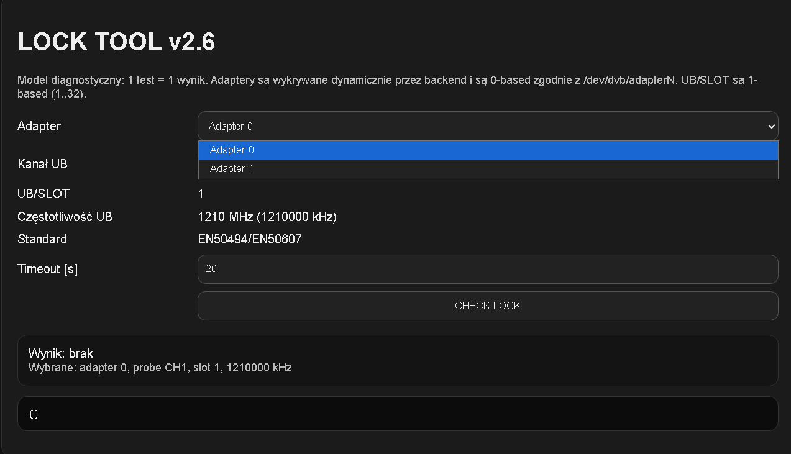
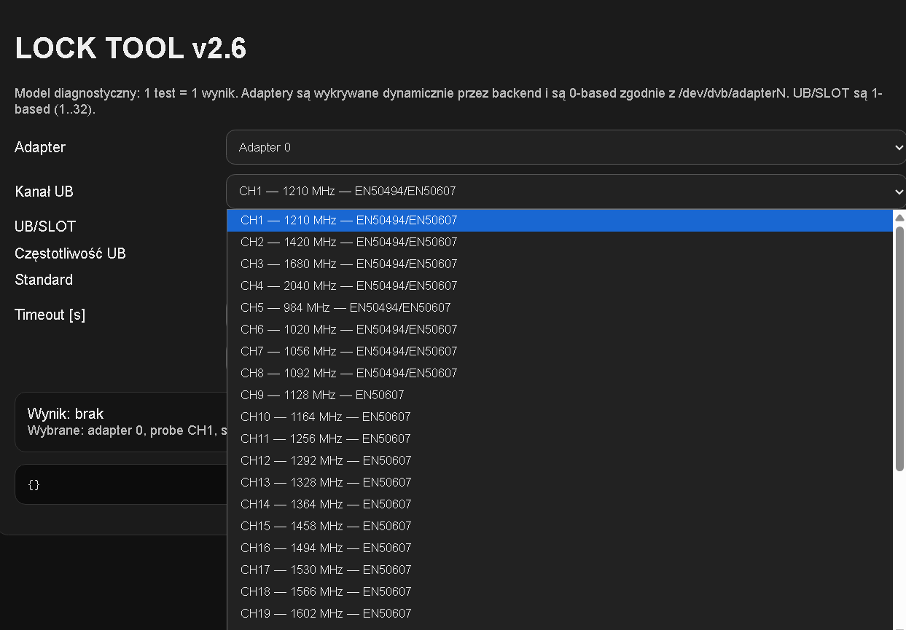
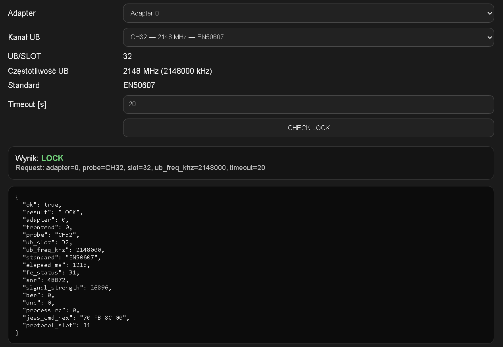

# unicable-lock-tool

DVB-S2 Unicable (EN50494) and JESS (EN50607) lock diagnostic 
tool for Linux with WebUI - dedicated for multi-adapter DVB-S2 cards

⚠️ - For license → open an Issue

---

## ⚠️ DISCLAIMER

This is an **experimental project**.  
No warranties, no guarantees, no support obligations.  
Use at your own risk.

---

## 📋 Requirements

- Linux (Ubuntu 22.04 LTS recommended)
- DVB-S2 adapter (multi-adapter cards supported)
- Root access (`sudo`)
- Python 3 + Flask
- **Active license** — required to operate

---

## 🚀 Installation

```bash
sudo bash install_launcher_lock_tool.sh
```

---

## 🔑 License

This software requires a valid license to operate.  
**$1 = 7 days** activation.

To obtain a license, contact the author.  
License is issued manually by the administrator.

> All rights reserved.  
> Redistribution, repackaging or resale is strictly prohibited.  
> This software may not be copied, modified or distributed  
> without explicit written permission from the author.

---

## 📡 Supported Standards

| Standard | Channels |
|----------|----------|
| EN50494 (Unicable I) | CH1 - CH8 |
| EN50607 (Unicable II / JESS) | CH1 - CH32 |

---

## 📁 Files

| File | Description |
|------|-------------|
| `launcher_lock_tool` | Main binary (license verification + core) |
| `install_launcher_lock_tool.sh` | Installer script |
| `uninstall_launcher_lock_tool.sh` | Uninstaller script |
| `webui.py` | WebUI panel |
| `lock.json` | Transponder configuration |

---

## ⚡ Quick Start

1. Download and install
2. Contact author for license activation
3. Run WebUI: `sudo systemctl enable --now lock-tool-webui`
4. Open browser: path from `install_launcher_lock_tool.sh`

---
## 🛠️ Transponder Configuration

Edit `lock.json` — only these values need to be changed:

```json
"rf_freq_khz": 10758000,   ← transponder frequency
"sr":          27500000,   ← symbol rate
"pol":         "V",        ← polarization V/H
"delivery_system": "DVBS2", ← DVB-S or DVB-S2
"modulation":  "8PSK",     ← modulation
"fec":         "3/4",      ← FEC rate
"sat_pos":     0           ← satellite position (0=default)
```

All other parameters are fixed. That's it! ✅


## 📡 LNB / Multiswitch Configuration

> ⚠️ **Important:** UB channel frequencies in `lock.json`
> must match **exactly** the values described in your 
> LNB or multiswitch manual/datasheet.

Always refer to your converter (LNB/multiswitch) documentation
for correct UB channel frequencies — values vary by 
manufacturer, model and region.

Update `ub_channels` section in `lock.json` accordingly:

```json
{ "id": 1, "slot": 1, "freq_khz": 1210000, "standard": ["EN50494", "EN50607"] },
{ "id": 2, "slot": 2, "freq_khz": 1420000, "standard": ["EN50494", "EN50607"] }
```

Frequency range: **950 MHz — 2150 MHz** (EN50607 standard)


## 📸 Screenshots





*Experimental project — work in progress*
